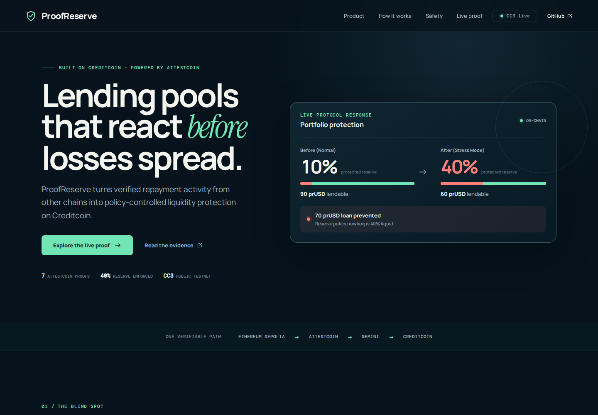

# ProofReserve

> Protected lending pools powered by verified cross-chain risk.

**[Open the live product](https://proofreserve.vercel.app)** · **[Inspect the AI-sensitive reserve transaction](https://creditcoin-testnet.blockscout.com/tx/0xfc25a12816d9967db8c414832c0f0771e4fd7ae013d055bc586ef39c7fc8c83e)**

ProofReserve is a Creditcoin DeFi application for operating lending pools that protect liquidity before borrower problems spread. It turns Attestcoin-verified borrower events from other chains into an AI-recommended safety reserve that Creditcoin contracts enforce.

A pool with 100 test tokens may normally protect 10 and lend 90. When several related borrowers become late on Ethereum Sepolia, Attestcoin proves those events, Gemini identifies the portfolio pattern, and the Creditcoin controller can protect 40 instead. The AI cannot move funds or override contract policy.

## Status

The complete MVP is live on Ethereum Sepolia and Creditcoin CC3 Testnet. Fourteen source transactions across two evidence epochs have been proven through Attestcoin and accepted on Creditcoin. The first epoch proves the 10% to 40% reserve consequence. The second proves AI necessity: deterministic rules return `WATCH`, while Gemini compares the value severity across the verified facts and recommends `STRESS` with 82% confidence. The Creditcoin controller accepted that exact block-pinned result. See the [initial testnet evidence](docs/testnet-evidence.md) and [AI-sensitive evidence](docs/ai-sensitive-evidence.md) for the complete public trails.

The live product includes a no-wallet capacity test. Enter a proposed loan and the browser performs two read-only simulations of the deployed pool's `commitLoan` function: at the last normal-reserve block and at the latest block. Try 50 prUSD (allowed in both states), 70 prUSD (allowed before and blocked now), and 95 prUSD (blocked in both states).

The pool-manager desk adds a permissioned write workflow for the deployed pool. The connected wallet must match the pool owner. It switches or adds Creditcoin CC3, validates the borrower and amount, performs a live `commitLoan` preflight, asks the wallet to sign only after that check passes, waits for the CC3 receipt, and exposes a cancellation action that restores capacity. A commitment reserves lending capacity but does not transfer pool funds.



## Demonstration flow

1. Fund a 100 prUSD pool on Creditcoin.
2. Record four small successful payments and two much larger late payments across separate borrower groups on Sepolia.
3. Let Attestcoin prove each fact and its checkpoint into Creditcoin.
4. Let Gemini explain the combined risk pattern within a closed schema.
5. Submit the assessment so the controller raises the protected reserve from 10% to 40%.
6. Use the live capacity test—or compare `pnpm capacity:check before` and `pnpm capacity:check after`—to show the pool itself allowing and then blocking the same 70 prUSD request without mutating demo state.

In one sentence: **ProofReserve notices verified trouble elsewhere and makes a Creditcoin lending pool keep more cash safe.**

See [the deployment and demo runbook](docs/deployment.md) for guarded commands and required testnet configuration.

## Why Attestcoin is essential

A Creditcoin contract cannot independently know whether a borrower paid late on Sepolia. A normal web API could report that event, but the pool would have to trust the API operator. Attestcoin supplies cryptographic proof that the source transaction belongs to the attested chain history. ProofReserve then validates the exact loan-book emitter, event type, borrower, group, sequence, epoch, and replay state before the fact may influence the pool.

Without Attestcoin, ProofReserve would be a lending pool trusting a centralized risk-data service. With Attestcoin, the evidence behind a reserve decision can be verified from public chain data.

## Product boundary

The hackathon MVP operates one fully verifiable protected pool. Repeatable self-service creation of additional pools is a product roadmap step and will not be presented as shipped unless its factory and onboarding path are deployed and tested.

`prUSD` is a test asset used to make the financial consequence visible. ProofReserve does not issue a production stablecoin and is not a generic token-creation platform.

## Product application

Run the responsive product locally:

    pnpm app:dev

It opens in a truthfully labeled preview state until the public `VITE_CREDITCOIN_RPC_URL`, evidence, controller, and pool addresses are configured. Set `VITE_NORMAL_STATE_BLOCK` to the final normal-reserve block to enable the before/after capacity comparison. Browser variables are public by definition: never place the Gemini key or a wallet private key behind a `VITE_` prefix.

To test the write workflow, connect the funded Creditcoin deployer wallet on the manager desk. For the public deployment in this repository, the expected owner is `0x7a490B6b4079E90C228d5CABb58bbedc9a51312b`. Use the prefilled test borrower, commit no more than the displayed lendable amount, and cancel the commitment after testing. Never enter or expose the wallet's private key in the application.

Create the production bundle with:

    pnpm app:build

## Verify the live product

Anyone can audit the full public path without a wallet, private key, or Gemini API key:

    pnpm verify:live

The command reads public Sepolia and Creditcoin CC3 RPCs and checks all seven epoch-2 source/acceptance transaction pairs, the processed Attestcoin query IDs, checkpoint root and payment totals, the deterministic `WATCH` baseline, the saved Gemini `STRESS` assessment and hashes, the Creditcoin enforcement receipt, the current 100/40/60 pool state, and the contract-level 70 prUSD rejection. `SOURCE_CHAIN_RPC_URL` and `CREDITCOIN_RPC_URL` may be supplied to override the built-in public endpoints.

## Trust boundary

- Attestcoin proves source-chain transaction inclusion and continuity.
- ProofReserve contracts validate the successful receipt, allowlisted emitter, exact event, subject, sequence, freshness, and replay state.
- AI recommends one finite policy regime.
- Creditcoin contracts retain final authority over the reserve and lending capacity.

## Development

Requirements: Node.js 22+, pnpm 10+, and Foundry.

```bash
pnpm install
pnpm check
pnpm preflight:testnet
```

Current local verification: 25 Solidity tests, one worker restart/idempotence test, sixteen risk-engine tests, and four pool-manager application tests pass; all TypeScript passes strict type-checking.

Live AI inference uses `gemini-3.8-flash` through the Gemini Developer API and requires a server-side `GEMINI_API_KEY`. The selected model is available on Google's free tier, so a paid AI account is not required within current quotas. HTTP 429 or temporary model failures cause the risk engine to fail safely to its deterministic baseline; a live Gemini result is still required for the judged AI-sensitive path.

Create a new auth key in [Google AI Studio](https://aistudio.google.com/app/apikey), copy `.env.example` to the ignored `.env` file, and place the key there locally. Load that environment only into the server-side worker before running `pnpm risk:assess risk/fixtures/stress-features.json`. Never put the key in frontend code or paste it into chat.

## Documentation

- [MVP product specification](./docs/product-spec.md)
- [Build slice](./docs/build-slice-01.md)
- [Reserve enforcement slice](./docs/build-slice-02.md)
- [Gemini risk engine slice](./docs/build-slice-03.md)
- [Evidence-to-reserve agent slice](./docs/build-slice-04.md)
- [Testnet deployment guide](./docs/deployment.md)
- [Public testnet evidence](./docs/testnet-evidence.md)
- [AI-sensitive decision evidence](./docs/ai-sensitive-evidence.md)
- [DoraHacks submission draft](./docs/submission/dorahacks-submission.md)
- [Pitch deck](./docs/pitch-deck.pdf)
- [Third-party notices](./THIRD_PARTY_NOTICES.md)

Keep the Gemini key in the server-side environment only. Free-tier prompts may be used by Google to improve its products, so ProofReserve sends only public testnet aggregate features and no personal borrower data. Testnet deployments separately need a wallet that can sign transactions and faucet funds for Sepolia and CC3 gas; neither secret should ever be committed or pasted into an issue or chat.

## Security notice

This is hackathon-stage testnet software. It is not audited and must not hold production funds.
